# M3 Ultra K3s Cluster

Production-ready K3s cluster automation for Apple M3 Ultra Mac hardware.

## 🚀 Features

- **🔄 Automated Rollback & Recovery** - Safe operations with automatic rollback on failure
- **📊 Built-in Observability** - Prometheus, Grafana, and Loki pre-configured
- **🔒 Security Hardening** - macOS-specific security configurations
- **🎯 GitOps Ready** - Prepared for ArgoCD/Flux deployment
- **🖥️ macOS Optimized** - Handles sleep/wake, mDNS, and APFS snapshots
- **📝 Comprehensive Logging** - All operations logged with rotation

## 📋 Prerequisites

- macOS on Apple Silicon (M3 Ultra)
- Homebrew installed
- SSH key-based authentication configured
- At least 20GB free disk space per node
- Network connectivity between all nodes

## 🏃 Quick Start

```bash
# Clone the repository
git clone https://github.com/doogie-bigmack/m3_ultra_cluster.git
cd m3_ultra_cluster

# Configure your nodes
cp configs/base/config.env.example configs/base/config.env
# Edit config.env with your node IPs and usernames

# Run preflight checks
./scripts/bootstrap/00-preflight.sh

# Install dependencies
./scripts/bootstrap/01-install-deps.sh

# Initialize control plane
./scripts/bootstrap/02-init-control.sh

# Join worker nodes
./scripts/bootstrap/03-join-workers.sh
```

## 📁 Repository Structure

```
├── scripts/
│   ├── bootstrap/        # Initial cluster setup
│   ├── rollback/         # Safety and recovery tools
│   ├── security/         # Security hardening scripts
│   ├── observability/    # Monitoring stack deployment
│   ├── operations/       # Day-2 operations
│   └── lib/             # Shared functions
├── configs/             # Configuration files
├── manifests/           # Kubernetes YAML files
├── docs/               # Documentation
└── tests/              # Test suites
```

## 🖼️ Reference Architecture


## ⏱️ Bootstrap Sequence

```mermaid
sequenceDiagram
    participant Dev as Developer
    participant Script as Bootstrap Script
    participant CP as Control-Plane
    participant W1 as Worker Node

    Dev->>Script: Run 00-preflight.sh
    Script->>Dev: Validate tools / config
    Dev->>Script: Run 01-install-deps.sh
    Script->>CP: Install packages via SSH
    Script->>W1: Install packages via SSH
    Dev->>Script: Run 02-init-control.sh
    Script->>CP: k3s server install
    CP-->>Script: Return join-token
    Script->>Dev: Write token to local file
    Dev->>Script: Run 03-join-workers.sh
    Script->>W1: k3s agent install --token
    W1-->>CP: Join cluster
    Script->>CP: Deploy addons (MetalLB, Ingress…)
    Script->>CP: Deploy observability stack
```



## 🔧 Configuration

### Node Configuration

The cluster supports per-node username configuration. Edit `configs/base/nodes.conf`:

```
# Format: IP_ADDRESS USERNAME ROLE NOTES
<CONTROL_PLANE_IP> <USERNAME> control-plane <NODE_NAME>
<WORKER_IP> <USERNAME> worker <NODE_NAME>
```

### Environment Variables

Key configuration options in `configs/base/config.env`:

- `CLUSTER_NAME` - Your cluster identifier
- `CONTROL_PLANE_IP` - Control plane node IP
- `WORKER_IPS` - Array of worker node IPs
- `K3S_VERSION` - K3s version to install

## 🛡️ Security

This project follows security best practices:

- No secrets or credentials in repository
- All sensitive data in `.env.local` (git-ignored)
- Automated security scanning via GitHub Actions
- RBAC and network policies pre-configured
- TLS certificates auto-generated and rotated

## 🔄 Rollback & Recovery

Every operation includes rollback capability:

```bash
# Create system snapshot before changes
./scripts/rollback/snapshot-system.sh

# Uninstall K3s from a node
./scripts/rollback/uninstall-node.sh <node-ip>

# Restore system to snapshot
./scripts/rollback/restore-system.sh
```

## 📊 Monitoring

The cluster includes a full observability stack:

- **Prometheus** - Metrics collection
- **Grafana** - Visualization dashboards  
- **Loki** - Log aggregation
- **AlertManager** - Alert routing

Deploy with:
```bash
./scripts/observability/deploy-stack.sh
```

## 🧪 Testing

Run the test suite:

```bash
# Unit tests
./tools/test-unit.sh

# Integration tests (requires running cluster)
./tools/test-integration.sh

# Smoke tests
./tools/test-smoke.sh
```

## 📖 Documentation

- [Architecture Overview](docs/architecture.md)
- [Security Guide](docs/security.md)
- [Troubleshooting](docs/troubleshooting.md)
- [Runbooks](docs/runbooks/)

## 🤝 Contributing

1. Fork the repository
2. Create your feature branch (`git checkout -b feature/amazing-feature`)
3. Commit your changes (`git commit -m 'feat: add amazing feature'`)
4. Push to the branch (`git push origin feature/amazing-feature`)
5. Open a Pull Request

## 📝 License

This project is licensed under the MIT License - see the [LICENSE](LICENSE) file for details.

## 🙏 Acknowledgments

- K3s team for the lightweight Kubernetes distribution
- k3sup for simplified installation
- The macOS community for Apple Silicon insights

## ⚠️ Important Notes

- This project is specifically designed for macOS on Apple Silicon
- Ensure all nodes have synchronized time (NTP)
- Disable sleep on cluster nodes for stability
- Regular backups are recommended

## 🚑 Support

- Open an issue for bugs or feature requests
- Check [troubleshooting guide](docs/troubleshooting.md) first
- Join our discussions for questions