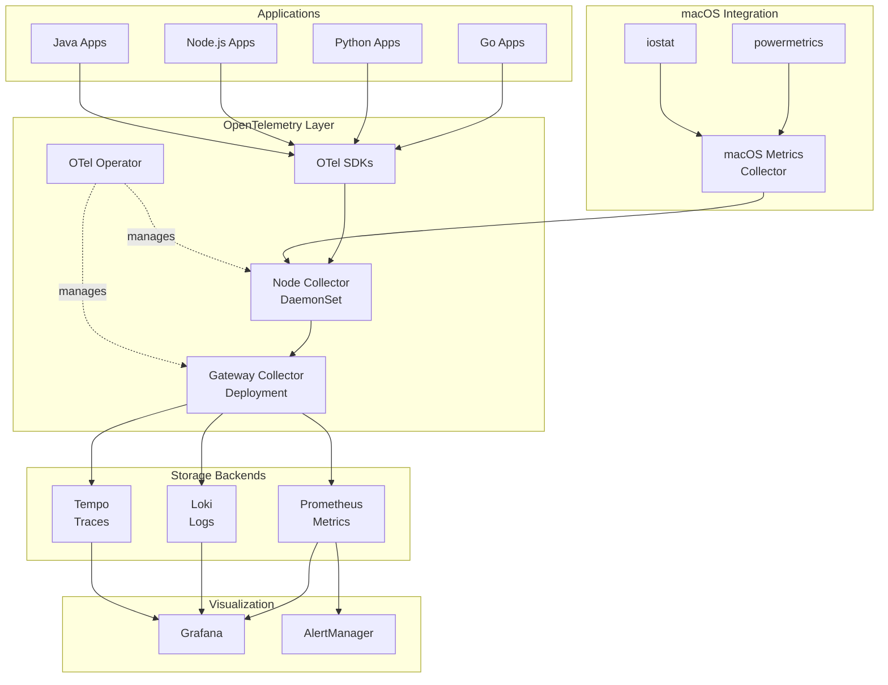

# OpenTelemetry Observability Design for M3 Ultra K3s Cluster

## Executive Summary

This document outlines the design for a comprehensive observability solution for the M3 Ultra K3s cluster using OpenTelemetry as the core collection framework. The solution provides unified collection of metrics, logs, and distributed traces with minimal performance overhead.

## Design Goals

1. **Unified Telemetry**: Single collection pipeline for all observability signals
2. **Performance**: Minimal impact on M3 Ultra nodes (<5% CPU, <1GB RAM per node)
3. **Scalability**: Handle 6+ nodes with room for growth
4. **macOS Native**: Leverage Apple Silicon specific metrics
5. **Developer Experience**: Auto-instrumentation for common languages
6. **Cost Efficiency**: Open source stack with efficient storage

## Architecture Overview



## Component Selection Rationale

### OpenTelemetry Collector
- **Why**: Industry standard, vendor-neutral, highly performant
- **Version**: Latest stable (0.96.0+)
- **Deployment Model**: 
  - DaemonSet for node-level collection
  - Deployment for gateway aggregation

### Storage Backends

#### Prometheus (Metrics)
- **Why**: De facto standard for Kubernetes metrics
- **Retention**: 30 days
- **Storage**: ~10GB per node per month
- **Scrape Interval**: 30s default, 10s for critical metrics

#### Loki (Logs)
- **Why**: Efficient log storage, Grafana native integration
- **Retention**: 7 days
- **Storage**: ~20GB per node per week
- **Index Period**: 24h

#### Tempo (Traces)
- **Why**: Cost-effective trace storage, no sampling required
- **Retention**: 72 hours
- **Storage**: ~5GB per million traces
- **Sampling**: Head-based at 10% for high-volume services

### Grafana
- **Why**: Unified visualization for all three signals
- **Features**: Native correlation between metrics, logs, and traces
- **Version**: 10.0+ for full OTel support

## Data Flow Patterns

### Metrics Flow
```
Application Metrics → OTel SDK → Node Collector → Gateway Collector → Prometheus Remote Write → Prometheus
System Metrics → Node Exporter → Node Collector → Gateway Collector → Prometheus
macOS Metrics → Custom Receiver → Node Collector → Gateway Collector → Prometheus
```

### Logs Flow
```
Application Logs → stdout/stderr → Filelog Receiver → Node Collector → Gateway Collector → Loki API → Loki
System Logs → journald → Filelog Receiver → Node Collector → Gateway Collector → Loki
```

### Traces Flow
```
Application Traces → OTel SDK → Node Collector → Gateway Collector → Tempo Distributor → Tempo
```

## Collector Configuration

### Node Collector (DaemonSet)
```yaml
receivers:
  otlp:
    protocols:
      grpc:
        endpoint: 0.0.0.0:4317
      http:
        endpoint: 0.0.0.0:4318
  
  prometheus:
    config:
      scrape_configs:
        - job_name: 'node-exporter'
          static_configs:
            - targets: ['localhost:9100']
  
  filelog:
    include: ['/var/log/pods/*/*/*.log']
    operators:
      - type: parser
        parser: kubernetes
  
  hostmetrics:
    collection_interval: 10s
    scrapers:
      cpu:
      disk:
      memory:
      network:
  
  # Custom macOS receiver
  macos_metrics:
    collection_interval: 30s
    metrics:
      - powermetrics
      - thermal
      - smc

processors:
  batch:
    timeout: 10s
    send_batch_size: 1024
  
  memory_limiter:
    check_interval: 1s
    limit_mib: 512
    spike_limit_mib: 128
  
  k8sattributes:
    auth_type: "serviceAccount"
    extract:
      metadata:
        - k8s.pod.name
        - k8s.pod.uid
        - k8s.deployment.name
        - k8s.namespace.name
        - k8s.node.name

exporters:
  otlp:
    endpoint: otel-gateway-collector:4317
    tls:
      insecure: true
```

### Gateway Collector (Deployment)
```yaml
receivers:
  otlp:
    protocols:
      grpc:
        endpoint: 0.0.0.0:4317

processors:
  batch:
    timeout: 10s
    send_batch_size: 10000
  
  memory_limiter:
    check_interval: 1s
    limit_mib: 2048
    spike_limit_mib: 512
  
  tail_sampling:
    policies:
      - name: errors-policy
        type: status_code
        status_code: {status_codes: [ERROR]}
      - name: slow-traces-policy
        type: latency
        latency: {threshold_ms: 1000}
      - name: probabilistic-policy
        type: probabilistic
        probabilistic: {sampling_percentage: 10}

exporters:
  prometheusremotewrite:
    endpoint: "http://prometheus:9090/api/v1/write"
  
  loki:
    endpoint: "http://loki:3100/loki/api/v1/push"
  
  otlp/tempo:
    endpoint: tempo-distributor:4317
    tls:
      insecure: true
```

## macOS-Specific Metrics Collection

### Custom Receiver Design
The macOS metrics receiver collects Apple Silicon specific metrics:

```go
type MacOSMetricsReceiver struct {
    // CPU temperature from SMC
    cpuTemperature float64
    
    // Power consumption from powermetrics
    cpuPowerWatts    float64
    gpuPowerWatts    float64
    systemPowerWatts float64
    
    // Memory pressure
    memoryPressure string
    
    // Thermal state
    thermalState int
}
```

### Collection Methods
1. **SMC Access**: Direct SMC reading for temperature sensors
2. **powermetrics**: Parse output for power consumption
3. **iostat**: Disk I/O statistics
4. **vm_stat**: Memory pressure and statistics

## Storage and Retention Strategy

### Prometheus Storage
- **Local Storage**: 2 weeks on NVMe
- **Long-term Storage**: NFS-backed for 30 days
- **Downsampling**: 5m resolution after 24h, 1h after 7d
- **Estimated Size**: 300GB total for 6 nodes

### Loki Storage
- **Chunks**: S3-compatible storage (MinIO on NFS)
- **Index**: Local BoltDB
- **Retention**: 7 days active, 30 days archive
- **Estimated Size**: 500GB active storage

### Tempo Storage
- **Backend**: S3-compatible storage (MinIO on NFS)
- **Retention**: 72 hours
- **Compaction**: Every 2 hours
- **Estimated Size**: 100GB rolling window

## Security Considerations

### Network Security
- **mTLS**: Between collectors and backends
- **Authentication**: Basic auth for Grafana, token for APIs
- **Network Policies**: Restrict traffic between namespaces

### Data Security
- **Encryption at Rest**: For NFS volumes
- **PII Scrubbing**: Remove sensitive data in processors
- **RBAC**: Limit collector permissions

### Access Control
- **Grafana**: OIDC integration (future)
- **API Access**: Token-based authentication
- **Audit Logging**: All access logged

## Performance Impact Analysis

### Per-Node Resource Usage
| Component | CPU | Memory | Network |
|-----------|-----|---------|---------|
| OTel Collector | 0.5 cores | 512MB | 10MB/s |
| Node Exporter | 0.1 cores | 128MB | 1MB/s |
| Promtail | 0.2 cores | 256MB | 5MB/s |
| **Total** | **0.8 cores** | **896MB** | **16MB/s** |

### Cluster-Wide Resource Usage
| Component | Replicas | CPU | Memory | Storage |
|-----------|----------|-----|---------|---------|
| Prometheus | 1 | 2 cores | 8GB | 300GB |
| Loki | 1 | 2 cores | 4GB | 500GB |
| Tempo | 1 | 2 cores | 4GB | 100GB |
| Grafana | 1 | 1 core | 2GB | 10GB |
| Gateway Collector | 2 | 1 core | 2GB | - |
| **Total** | **6** | **8 cores** | **20GB** | **910GB** |

## High Availability Considerations

### Component HA Strategy
- **Collectors**: DaemonSet ensures one per node
- **Gateway**: 2 replicas with load balancing
- **Prometheus**: Single instance (HA in future)
- **Loki**: Single instance with replication factor 2
- **Tempo**: Single instance (stateless ingestion)
- **Grafana**: Single instance with SQLite backup

### Failure Scenarios
1. **Node Failure**: Collectors on other nodes continue
2. **Gateway Failure**: Second replica takes over
3. **Storage Failure**: NFS replication protects data
4. **Network Partition**: Local buffering in collectors

## Scalability Considerations

### Horizontal Scaling
- **Collectors**: Automatically scale with nodes
- **Gateway**: Increase replicas as needed
- **Storage**: Shard Prometheus, scale Loki/Tempo

### Vertical Scaling
- **Adjust Memory Limits**: Based on actual usage
- **Increase Batch Sizes**: For better throughput
- **Tune Sampling**: Reduce trace volume if needed

## Implementation Phases

### Phase 1: Foundation (Week 1)
- Deploy OTel Operator
- Basic collector configuration
- Prometheus deployment

### Phase 2: Logs & Traces (Week 2)
- Loki deployment
- Tempo deployment
- Collector pipeline configuration

### Phase 3: Visualization (Week 3)
- Grafana deployment
- Dashboard creation
- Alert configuration

### Phase 4: macOS Integration (Week 4)
- Custom receiver development
- macOS dashboard creation
- Performance tuning

## Success Metrics

1. **Collection Coverage**: 100% of nodes reporting
2. **Data Completeness**: <1% data loss
3. **Query Performance**: p99 < 5s for dashboards
4. **Resource Usage**: <5% cluster resources
5. **MTTR**: <5 minutes to identify issues

## Future Enhancements

1. **Machine Learning**: Anomaly detection on metrics
2. **Synthetic Monitoring**: Probe-based health checks
3. **Continuous Profiling**: CPU/memory profiling
4. **eBPF Integration**: Network flow monitoring
5. **Cost Attribution**: Resource usage per team/app